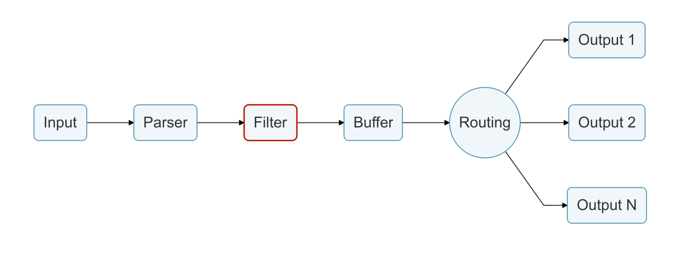

# 过滤器

在生产环境中，我们希望可以完全控制所收集的数据，过滤是一项重要功能，可让我们在将数据传递到某个目的地之前对其进行**修改**。

过滤是通过插件实现的，因此每个可用的过滤器都可用于通过某些特定的元数据来匹配，排除或丰富您的日志。

我们支持许多过滤器。过滤器的一个常见应用场景是 Kubernetes deployments。每个 Pod 日志都需要获取正确的关联元数据。

输入插件非常相似，过滤器在实例的上下文中运行，实例上下文具有自己的独立配置。配置的键通常称为**properties\(属性\)**。

有关可用过滤器及其用法的更多详细信息，请参阅[过滤器](https://docs.fluentbit.io/manual/pipeline/filters)部分。

