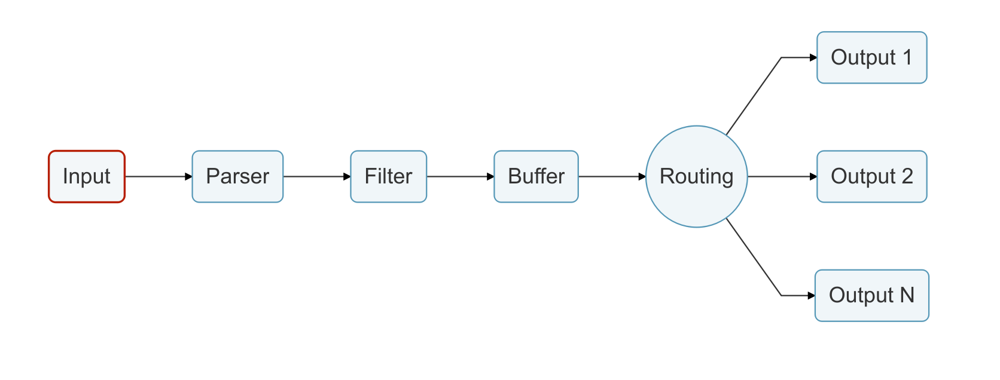

# 输入

[Fluent Bit](http://fluentbit.io) 提供了不同的 _输入插件_ 来收集不同来源的信息，其中一些是从日志文件中收集数据，另一些可以从操作系统中收集指标信息。根据不同的需求有许多不同的插件。

加载输入插件后，将创建一个内部 _instance\(实例\)_，每个实例都有其自己的独立配置，配置的键通常称为**properties\(属性\)**。

每个配置插件都有其自己的独立文档，在其文档中说明了如何使用它以及其可用的属性。

更多细节请参阅[输入插件](../../pipeline/inputs/)部分。

