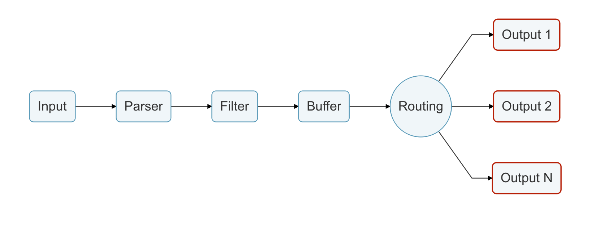

# Output

输出接口让我们能够定义数据的目的地。常见的目标是远程服务，本地文件系统或其它服务的标准接口。输出被实现为插件，并且包含众多可用插件。

加载输出插件后，将创建一个内部 _instance(实例)_，每个实例都有其自己的独立配置，配置的键通常称为**properties(属性)**。

每个配置插件都有其自己的独立文档，在其文档中说明了如何使用它以及其可用的属性。

更多细节请参阅[输入插件](https://docs.fluentbit.io/manual/pipeline/inputs)部分。
