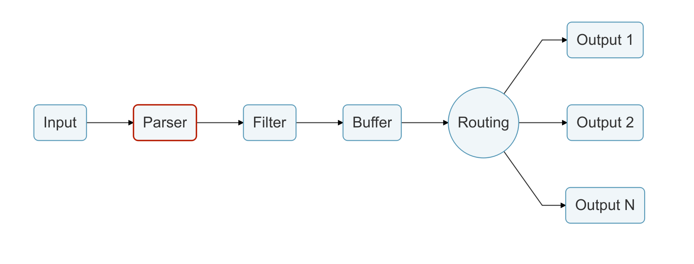

# 解析器

处理原始字符串或非结构化消息一直很痛苦; 极度希望消息是有结构的。理想情况下，我们希望在输入插件收集到输入数据后立即将它们转化为结构化消息:



解析器使可以将数据从非结构化数据转换为结构化数据。作为示例，请参考以下 Apache \(HTTP Server\) 的日志:

```text
192.168.2.20 - - [28/Jul/2006:10:27:10 -0300] "GET /cgi-bin/try/ HTTP/1.0" 200 3395
```

上面的日志行是没有格式的原始字符串，理想情况下，我们希望为它提供一个可以在以后轻松处理的结构。如果使用正确的配置，则日志条目可以转换为:

```javascript
{
  "host":    "192.168.2.20",
  "user":    "-",
  "method":  "GET",
  "path":    "/cgi-bin/try/",
  "code":    "200",
  "size":    "3395",
  "referer": "",
  "agent":   ""
 }
```

解析器是完全可配置的，并且可以由每个输入插件独立且可选地进行处理，有关更多详细信息，请参阅[解析器](https://docs.fluentbit.io/manual/pipeline/parsers)部分。

