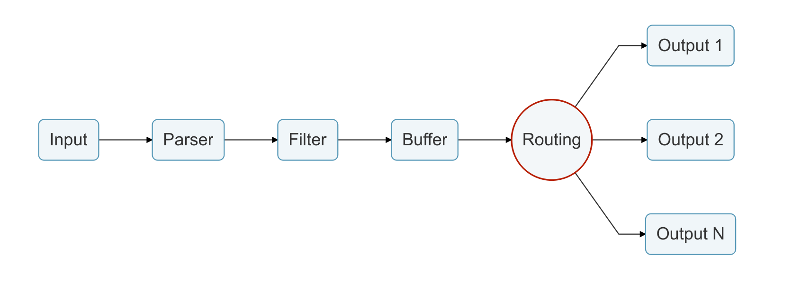

# 路由

路由是一项核心功能，它允许您通过过滤器**路由**您的数据，最后到达一个或多个目的地。路由器依赖[标签](../key-concepts.md#tag)和[匹配](../key-concepts.md#match)规则的概念。



路由中有两个重要概念:

* Tag
* Match

当数据由输入插件生成时，它带有**Tag**\(大多数情况下，是手动配置标签\)。标签是易于识别的标志，有助于识别数据源。

为了指定应将数据路由到**何处**，必须在输出配置中指定**匹配**规则。

考虑如下配置示例，该示例将 CPU 指标传递给 Elasticsearch 数据库，将内存指标传递给标准输出接口:

```text
[INPUT]
    Name cpu
    Tag  my_cpu

[INPUT]
    Name mem
    Tag  my_mem

[OUTPUT]
    Name   es
    Match  my_cpu

[OUTPUT]
    Name   stdout
    Match  my_mem
```

> 注意: 以上是演示如何配置路由的一个简单示例。

路由会自动读取 Input Tag 和 Output Match 规则。如果某些数据的 Tag 与路由阶段的规则不匹配，则该数据将被删除。

## 使用通配符路由 <a id="routing-with-wildcard"></a>

路由足够灵活，支持**Match**模式中的 _wildcard\(通配符\)_。下面的示例为两个数据源定义了一个公共目标:

```text
[INPUT]
    Name cpu
    Tag  my_cpu

[INPUT]
    Name mem
    Tag  my_mem

[OUTPUT]
    Name   stdout
    Match  my_*
```

匹配规则设置为 **`my_*`**，它将匹配以 **`my_`** 开头的所有标签。

