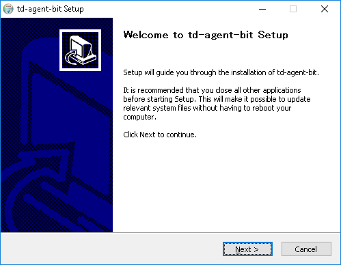

# Windows

Fluent Bit 在 Windows 上发布的件包为 **td-agent-bit**。Fluent Bit 有两种 Windows 安装程序: ZIP 压缩包\(用于快速测试\)和 EXE 安装程序\(用于系统安装\)。

## 安装包

最新的稳定版本是 1.4.4。

| 安装包 | SHA256 检验码 |
| :--- | :--- |
| [td-agent-bit-1.4.4-win32.exe](https://fluentbit.io/releases/1.4/td-agent-bit-1.4.4-win32.exe) | 80b06edeac188c01ee779af720fd923de8882028ec0253f172f74ad90634e2f1 |
| [td-agent-bit-1.4.4-win32.zip](https://fluentbit.io/releases/1.4/td-agent-bit-1.4.4-win32.zip) | 2f11f461842f0d47f2f3e5d332c8591d8ea8bf9c4436d2edaa794d750e83fd4e |
| [td-agent-bit-1.4.4-win64.exe](https://fluentbit.io/releases/1.4/td-agent-bit-1.4.4-win64.exe) | 846c453203c278a057205545a6346e686c7a50ae5ac5eaac64ffc65328853480 |
| [td-agent-bit-1.4.4-win64.zip](https://fluentbit.io/releases/1.4/td-agent-bit-1.4.4-win64.zip) | 35e24fb8c442980191b57a817dd86fdebec12e197cc153bd2aaf659dcf0a5b12 |

请在 PowerShell 上使用`Get-FileHash` 命令行检查完整性。

```text
PS> Get-FileHash td-agent-bit-1.4.4-win32.exe
```

## 使用 ZIP 压缩包安装

从[下载页面](https://fluentbit.io/)下载 ZIP 压缩包。其中包含有适用于 32 位和 64 位环境的安装程序，因此请选择适合您的环境的安装程序。

然后，您需要解压 ZIP 压缩包。您可以通过在资源管理器上单击"全部提取"来执行此操作，或者在 PowerShell 上使用 `Expand-Archive` 命令行。

```text
PS> Expand-Archive td-agent-bit-1.4.4-win64.zip
```

ZIP 压缩包包含如下文件:

```text
td-agent-bit
├── bin
│   ├── fluent-bit.dll
│   └── fluent-bit.exe
├── conf
│   ├── fluent-bit.conf
│   ├── parsers.conf
│   └── plugins.conf
└── include
    │   ├── flb_api.h
    │   ├── ...
    │   └── flb_worker.h
    └── fluent-bit.h
```

现在，在计算机上启动 cmd.exe 或 PowerShell，并按如下所示执行 `fluent-bit.exe`。

```text
PS> .\bin\fluent-bit.exe -i dummy -o stdout
```

如果看到以下输出，则工作正常!

```text
PS> .\bin\fluent-bit.exe  -i dummy -o stdout
Fluent Bit v1.4.x
* Copyright (C) 2019-2020 The Fluent Bit Authors
* Copyright (C) 2015-2018 Treasure Data
* Fluent Bit is a CNCF sub-project under the umbrella of Fluentd
* https://fluentbit.io

[2019/06/28 10:13:04] [ info] [storage] initializing...
[2019/06/28 10:13:04] [ info] [storage] in-memory
[2019/06/28 10:13:04] [ info] [storage] normal synchronization mode, checksum disabled, max_chunks_up=128
[2019/06/28 10:13:04] [ info] [engine] started (pid=10324)
[2019/06/28 10:13:04] [ info] [sp] stream processor started
[0] dummy.0: [1561684385.443823800, {"message"=>"dummy"}]
[1] dummy.0: [1561684386.428399000, {"message"=>"dummy"}]
[2] dummy.0: [1561684387.443641900, {"message"=>"dummy"}]
[3] dummy.0: [1561684388.441405800, {"message"=>"dummy"}]
```

在终端中按 `CTRL-C` 停止该程序。

## 使用 EXE 安装

从[下载页面](https://fluentbit.io/)下载 EXE 安装程序。其中包含有适用于 32 位和 64 位环境的安装程序，因此请选择适合您的环境的安装程序。

然后，双击您下载的 EXE 安装程序，安装向导将自动启动。



单击 Next 并继续。默认情况下，Fluent Bit 被安装在 `C:\Program Files\td-agent-bit\` 中，因此安装后您可以使用如下命令启动 fluent-bit。

```text
PS> C:\Program Files\td-agent-bit\bin\fluent-bit.exe -i dummy -o stdout
```

