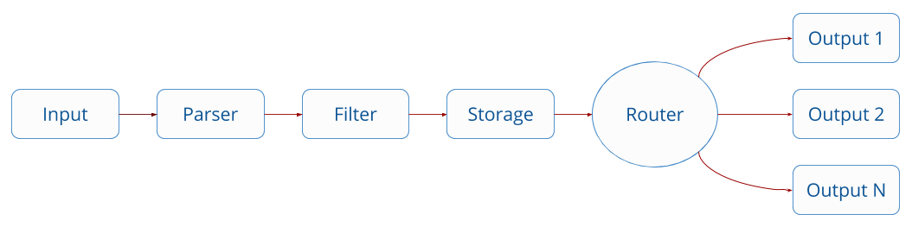
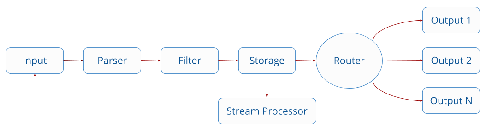

# 总览

流处理是在连续数据流仍在流动时对其进行查询的功能。[Fluent Bit](https://fluentbit.io) 实现了可用于此过程的Streaming SQL Engine\(流式结构查询语言\)。

为了理解流处理在 Fluent Bit 中的工作方式，我们将快速浏览 Fluent Bit 架构以及数据是如何通过管道的。

## Fluent Bit Data Pipeline

[Fluent Bit](https://fluentbit.io) 从不同的输入源收集和处理日志\(记录\)，并允许在记录到达存储层之前对其进行分析和过滤。数据被处理并且处于安全状态\(在内存或文件系统中\)，记录通过正确的输出目标进行路由。

> 管道中的大多数阶段都是通过插件实现的: 输入，过滤器和输出。

过滤接口可以对特定的记录修改，例如添加或删除键，添加特定的元数据\(如 Kubernetes 过滤器\)或根据特定条件丢弃记录。在数据将不再进行任何进一步修改并到达存储之后，可以选择将其重定向到流处理器。

## Stream Processor

流处理器是一个独立的子系统，用于检查到达存储接口的新记录。通过配置，流处理器将附加到来自特定输入插件\(stream\)的记录或通过应用标签和匹配规则。

> 每个输入实例都被视为**\(\)流**，该流收集数据并将记录提取到管道中。

通过配置特定的 SQL 查询\(结构化查询语言\)，用户可以执行特定的任务，例如键选择,筛选和其他内部数据的聚合。请注意，这里没有数据库概念，所有内容都是**无模式**的，并且在**内存**中发生，因此不像常见的关系数据库那样存在表的概念。

Fluent Bit 流处理器的强大功能之一是允许使用先前 SQL 查询的结果创建新的数据流，这些结果被重新输入到管道中，再次供流处理器使用\(如果需要\)，或通过使用标签/匹配规则路由到输出目的地\(例如所有通用记录\)\(提示: 流处理器的结果可以打标签!\)。

